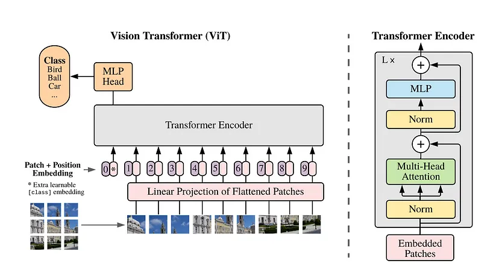

# ViT
##  AN IMAGE IS WORTH 16X16 WORDS:   TRANSFORMERS FOR IMAGE RECOGNITION AT SCALE

Ref: https://arxiv.org/pdf/2010.11929

## ABSTRACT
While the Transformer architecture has become the de-facto standard for natural
language processing tasks, its applications to computer vision remain limited. In
vision, attention is either applied in conjunction with convolutional networks, or
used to replace certain components of convolutional networks while keeping their
overall structure in place. We show that this reliance on CNNs is not necessary
and apure transformer applied directly to sequences of image patches can perform
very well on image classification tasks. When pre-trained on large amounts of
data and transferred to multiple mid-sized or small image recognition benchmarks
(ImageNet, CIFAR-100, VTAB, etc.), Vision Transformer (ViT) attains excellent
results compared to state-of-the-art convolutional networks while requiring substantially fewer computational resources to train.

## INTRODUCTION
Self-attention-based architectures, in particular Transformers (Vaswani et al., 2017), have become
 the model of choice in natural language processing (NLP). The dominant approach is to pre-train on
 a large text corpus and then fine-tune on a smaller task-specific dataset (Devlin et al., 2019). Thanks
 to Transformers’ computational efficiency and scalability, it has become possible to train models of
 unprecedented size, with over 100B parameters (Brown et al., 2020; Lepikhin et al., 2020). With the
 models and datasets growing, there is still no sign of saturating performance.
 In computer vision, however, convolutional architectures remain dominant (LeCun et al., 1989;
 Krizhevsky et al., 2012; He et al., 2016). Inspired by NLP successes, multiple works try combining
 CNN-like architectures with self-attention (Wang et al., 2018; Carion et al., 2020), some replacing
 the convolutions entirely (Ramachandran et al., 2019; Wang et al., 2020a). The latter models, while
 theoretically efficient, have not yet been scaled effectively on modern hardware accelerators due to
 the use of specialized attention patterns. Therefore, in large-scale image recognition, classic ResNet
like architectures are still state of the art (Mahajan et al., 2018; Xie et al., 2020; Kolesnikov et al.,
 2020).
 Inspired by the Transformer scaling successes in NLP, we experiment with applying a standard
 Transformer directly to images, with the fewest possible modifications. To do so, we split an image
 into patches and provide the sequence of linear embeddings of these patches as an input to a Trans
former. Image patches are treated the same way as tokens (words) in an NLP application. We train
 the model on image classification in supervised fashion.
 When trained on mid-sized datasets such as ImageNet without strong regularization, these mod
els yield modest accuracies of a few percentage points below ResNets of comparable size. This
 seemingly discouraging outcome may be expected: Transformers lack some of the inductive biases inherent to CNNs, such as translation equivariance and locality, and therefore do not generalize well
 when trained on insufficient amounts of data.
 However, the picture changes if the models are trained on larger datasets (14M-300M images). We
 find that large scale training trumps inductive bias. Our Vision Transformer (ViT) attains excellent
 results when pre-trained at sufficient scale and transferred to tasks with fewer datapoints. When
 pre-trained on the public ImageNet-21k dataset or the in-house JFT-300M dataset, ViT approaches
 or beats state of the art on multiple image recognition benchmarks. In particular, the best model
 reaches the accuracy of 8855% on ImageNet, 9072% on ImageNet-ReaL, 9455% on CIFAR-100,
 and 7763% on the VTAB suite of 19 tasks.

## Architecture

## Diffusion Model

## LVM
https://arxiv.org/pdf/2312.00785  
Sequential Modeling Enables Scalable Learning for Large Vision Models
<embed src="resource/pdf/2312.00785.pdf" width="100%" height="600px" type="application/pdf">

## SAM2

<video src="resource/video/sam2.mp4" width="640" height="480" controls></video>

