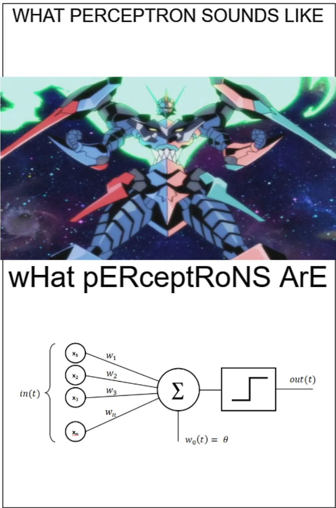
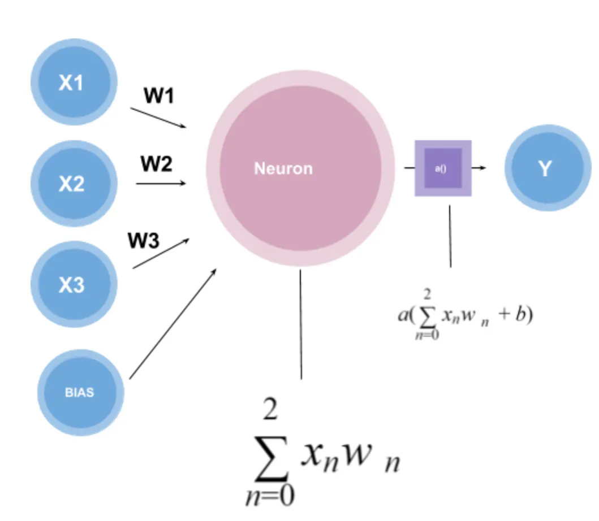
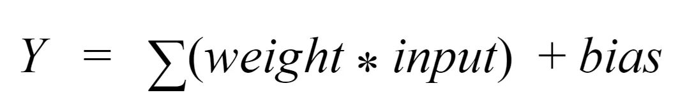
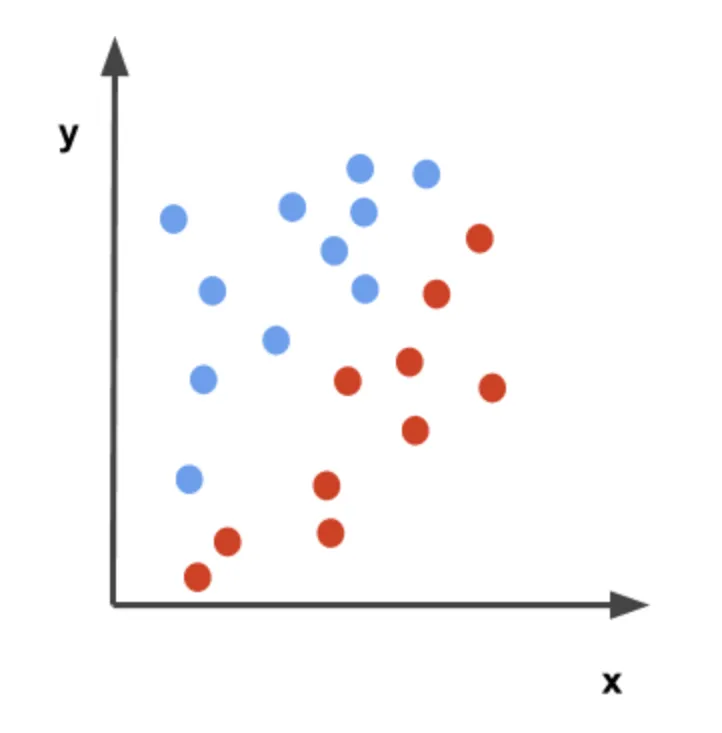
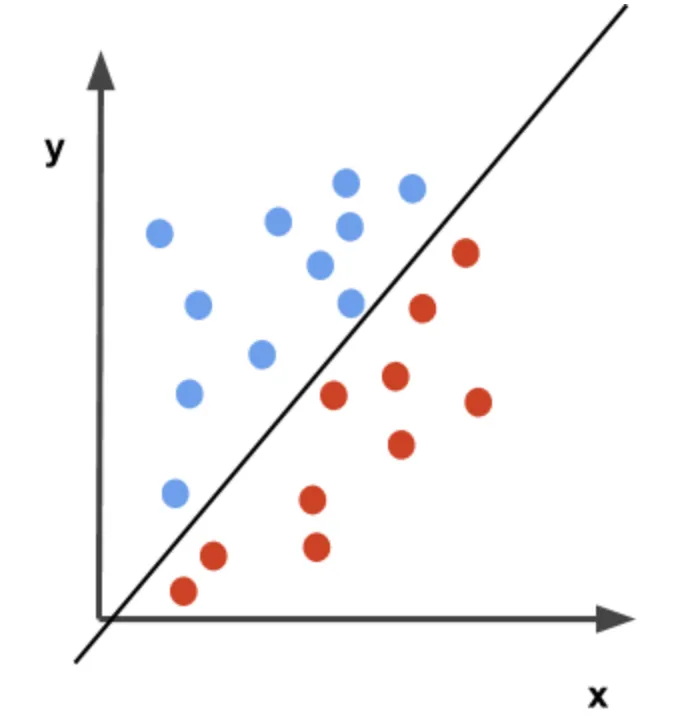
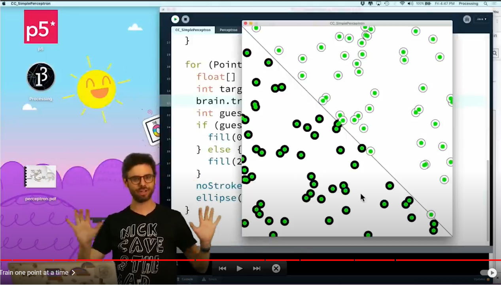

# Perceptron (1958)
Ref: https://towardsdatascience.com/what-is-a-perceptron-basics-of-neural-networks-c4cfea20c590

## What is a Perceptron? – Basics of Neural Networks
### An overview of the history of perceptrons and how they work.

A single-layer perceptron is the basic unit of a neural network. A perceptron consists of input values, weights and a bias, a weighted sum and activation function.

Represented visually we see (where typically the bias is represented near the inputs),

Let’s also create a graph with two different categories of data represented with red and blue dots.

we see that a perceptron can do basic classification using a decision boundary.

If you are interested in creating your own perceptron check this video out!
[]
https://youtu.be/ntKn5TPHHAk?si=132WcjoIGP6y7q2P

## multilayer perceptrons

**Note**:
A three layer neural network can represent any multivariate function .
https://arxiv.org/abs/2012.03016  
In 1987, Hecht-Nielsen showed that any continuous multivariate function can be implemented by a certain type three-layer neural network. This result was very much discussed in neural network literature. In this paper we prove that not only continuous functions but also all discontinuous functions can be implemented by such neural networks.

