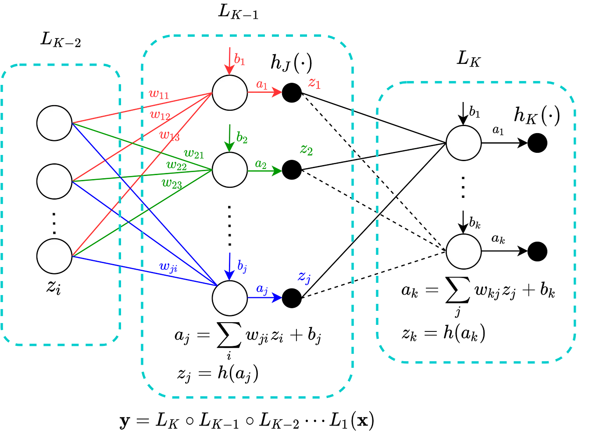
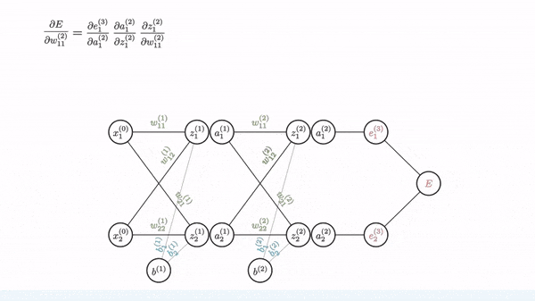
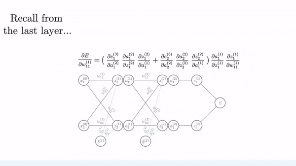

# Error Backpropagation
## A Neural Network from scratch to explain Error Backpropagation
http://homepages.math.uic.edu/~lreyzin/papers/rosenblatt58.pdf

Neural Networks (NN) , the technology from which Deep learning is founded upon, is quite popular in Machine Learning. I remember back in 2015 after reading the article, A Neural network in 11 lines of python code, by Andrew Trask, I was immediately hooked on to the field of Artificial Intelligence. But try building a NN from scratch, I believe most people would agree with me that Error Backpropagation or simply Backprop (BP) would be one of the early obstacles in accomplishing this task, at least depending on the depth you are willing to dive into. For those who are not familiar, BP is the algorithm used along with an optimization algorithm such as Gradient Descent (GD) to learn the parameters of a NN model. BP produces gradients which are then used in optimization. In this article, I will attempt to explain how this algorithm works, and then build a simple neural network from scratch to test this network on a regression problem I used in my previous post. For those who are struggling with this algorithm, I hope this article acts as an intuitive guide.

Given an error function such as the root mean square, error gradients of the last layer can be found using partial differentiation.

## Deeper Layers

