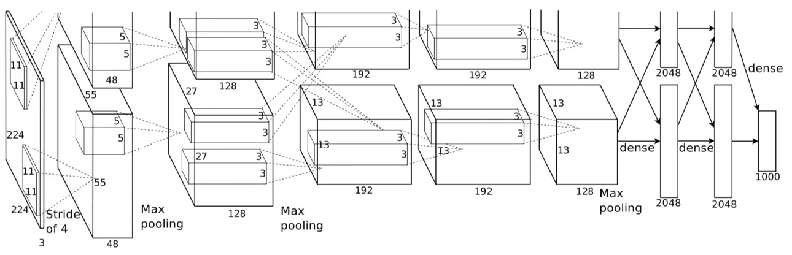
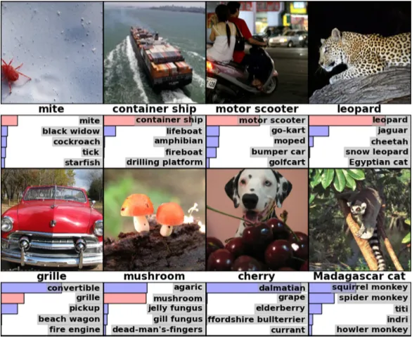

# AlexNet
ImageNet Classification with Deep Convolutional
 Neural Networks  

**Authors**: 
Alex Krizhevsky
University of Toronto 
kriz@cs.utoronto.ca  
Ilya Sutskever
University of Toronto
ilya@cs.utoronto.ca 
Geoffrey E. Hinton
University of Toronto
hinton@cs.utoronto.ca

**AlexNet**. The architecture consists of eight layers: five convolutional layers and three fully-connected layers. But this isn’t what makes AlexNet special; these are some of the features used that are new approaches to convolutional neural networks:

**ReLU Nonlinearity**. AlexNet uses Rectified Linear Units (ReLU) instead of the tanh function, which was standard at the time. ReLU’s advantage is in training time; a CNN using ReLU was able to reach a 25% error on the CIFAR-10 dataset six times faster than a CNN using tanh. 
**Multiple GPUs**. Back in the day, GPUs were still rolling around with 3 gigabytes of memory (nowadays those kinds of memory would be rookie numbers). This was especially bad because the training set had 1.2 million images. AlexNet allows for multi-GPU training by putting half of the model’s neurons on one GPU and the other half on another GPU. Not only does this mean that a bigger model can be trained, but it also cuts down on the training time.  
**Overlapping Pooling**. CNNs traditionally “pool” outputs of neighboring groups of neurons with no overlapping. However, when the authors introduced overlap, they saw a reduction in error by about 0.5% and found that models with overlapping pooling generally find it harder to overfit.   

**The Overfitting Problem**. AlexNet had 60 million parameters, a major issue in terms of overfitting. Two methods were employed to reduce overfitting:

**Data Augmentation**. The authors used label-preserving transformation to make their data more varied. Specifically, they generated image translations and horizontal reflections, which increased the training set by a factor of 2048. They also performed Principle Component Analysis (PCA) on the RGB pixel values to change the intensities of RGB channels, which reduced the top-1 error rate by more than 1%. 
**Dropout**. This technique consists of “turning off” neurons with a predetermined probability (e.g. 50%). This means that every iteration uses a different sample of the model’s parameters, which forces each neuron to have more robust features that can be used with other random neurons. However, dropout also increases the training time needed for the model’s convergence.  

**The Results**. On the 2010 version of the ImageNet competition, the best model achieved 47.1% top-1 error and 28.2% top-5 error. AlexNet vastly outpaced this with a 37.5% top-1 error and a 17.0% top-5 error. AlexNet is able to recognize off-center objects and most of its top five classes for each image are reasonable. AlexNet won the 2012 ImageNet competition with a top-5 error rate of 15.3%, compared to the second place top-5 error rate of 26.2%.

[AlexNet’s most probable labels on eight ImageNet images. The correct label is written under each image, and the probability assigned to each label is also shown by the bars. Image credits to Krizhevsky et al., the original authors of the AlexNet paper.
]

Ref: https://proceedings.neurips.cc/paper_files/paper/2012/file/c399862d3b9d6b76c8436e924a68c45b-Paper.pdf
