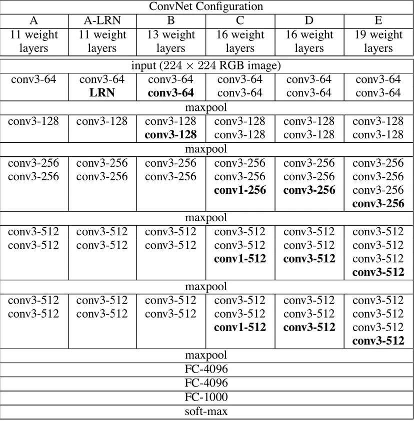

# VGG Neural Networks: The Next Step After AlexNet
AlexNet came out in 2012 and was a revolutionary advancement; it improved on traditional Convolutional Neural Networks (CNNs) and became one of the best models for image classification… until VGG came out.

**VGG Neural Networks**. While previous derivatives of AlexNet focused on smaller window sizes and strides in the first convolutional layer, VGG addresses another very important aspect of CNNs: depth. Let’s go over the architecture of VGG:

**Input**. VGG takes in a 224x224 pixel RGB image. For the ImageNet competition, the authors cropped out the center 224x224 patch in each image to keep the input image size consistent. 
**Convolutional Layers**. The convolutional layers in VGG use a very small receptive field (3x3, the smallest possible size that still captures left/right and up/down). There are also 1x1 convolution filters which act as a linear transformation of the input, which is followed by a ReLU unit. The convolution stride is fixed to 1 pixel so that the spatial resolution is preserved after convolution. 
**Fully-Connected Layers**. VGG has three fully-connected layers: the first two have 4096 channels each and the third has 1000 channels, 1 for each class.
**Hidden Layers**. All of VGG’s hidden layers use ReLU (a huge innovation from AlexNet that cut training time). VGG does not generally use Local Response Normalization (LRN), as LRN increases memory consumption and training time with no particular increase in accuracy. 
**The Difference**. VGG, while based off of AlexNet, has several differences that separates it from other competing models:

- Instead of using large receptive fields like AlexNet (11x11 with a stride of 4), VGG uses very small receptive fields (3x3 with a stride of 1). Because there are now three ReLU units instead of just one, the decision function is more discriminative. There are also fewer parameters (27 times the number of channels instead of AlexNet’s 49 times the number of channels). 
- VGG incorporates 1x1 convolutional layers to make the decision function more non-linear without changing the receptive fields.
- The small-size convolution filters allows VGG to have a large number of weight layers; of course, more layers leads to improved performance. This isn’t an uncommon feature, though. GoogLeNet, another model that uses deep CNNs and small convolution filters, was also showed up in the 2014 ImageNet competition.

Ref: https://towardsdatascience.com/vgg-neural-networks-the-next-step-after-alexnet-3f91fa9ffe2c
