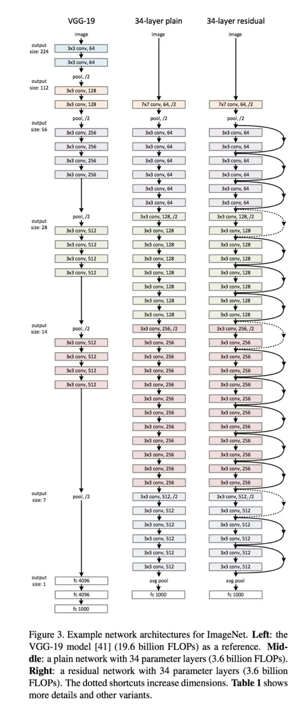

# Understanding and visualizing ResNets

## Background
Researchers observed that it makes sense to affirm that “the deeper the better” when it comes to convolutional neural networks. This makes sense, since the models should be more capable (their flexibility to adapt to any space increase because they have a bigger parameter space to explore). However, it has been noticed that after some depth, the performance degrades.

This was one of the bottlenecks of VGG. They couldn’t go as deep as wanted, because they started to lose generalization capability.

## What problems ResNets solve?
One of the problems ResNets solve is the famous known vanishing gradient. This is because when the network is too deep, the gradients from where the loss function is calculated easily shrink to zero after several applications of the chain rule. This result on the weights never updating its values and therefore, no learning is being performed.

With ResNets, the gradients can flow directly through the skip connections backwards from later layers to initial filters.

## Architecture

Ref: https://towardsdatascience.com/understanding-and-visualizing-resnets-442284831be8