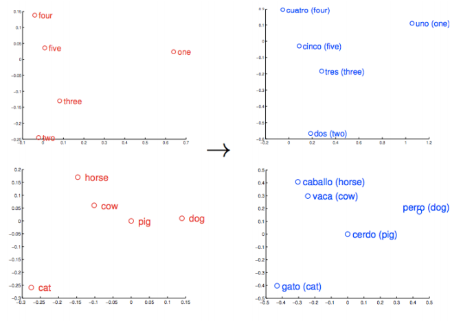
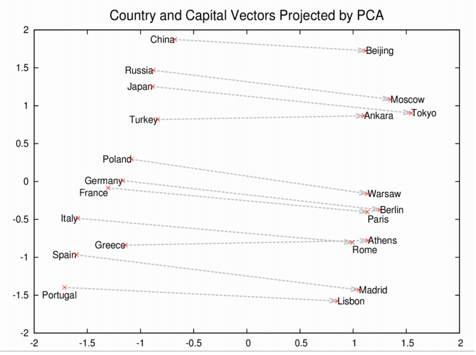

# Word Embedding and Word2Vec

## Why do we need them?

Consider the following similar sentences: Have a good day and Have a great day. They hardly have different meaning. If we construct an exhaustive vocabulary (let’s call it V), it would have V = {Have, a, good, great, day}.

Now, let us create a one-hot encoded vector for each of these words in V. Length of our one-hot encoded vector would be equal to the size of V (=5). We would have a vector of zeros except for the element at the index representing the corresponding word in the vocabulary. That particular element would be one. The encodings below would explain this better.

Have = [1,0,0,0,0]`; a=[0,1,0,0,0]` ; good=[0,0,1,0,0]` ; great=[0,0,0,1,0]` ; day=[0,0,0,0,1]` (` represents transpose)

If we try to visualize these encodings, we can think of a 5 dimensional space, where each word occupies one of the dimensions and has nothing to do with the rest (no projection along the other dimensions). This means ‘good’ and ‘great’ are as different as ‘day’ and ‘have’, which is not true.

Our objective is to have words with similar context occupy close spatial positions. Mathematically, the cosine of the angle between such vectors should be close to 1, i.e. angle close to 0.

## How Does Word2Vec Work?

Word2Vec employs two main architectures: Continuous Bag of Words (CBOW) and Skip-gram.

Continuous Bag of Words (CBOW):

CBOW predicts the target word based on its context (surrounding words).

It uses the context words as input to predict the target word.

This architecture is efficient for smaller datasets and frequent words.

Skip-gram:

Skip-gram predicts the context words given a target word.

It uses the target word as input to predict the context words.

Skip-gram performs well with larger datasets and infrequent words.

## Samples

