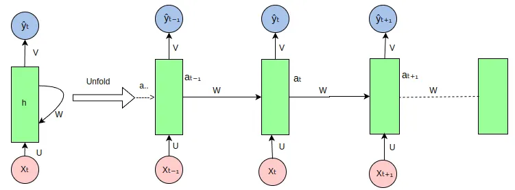
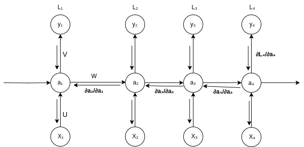
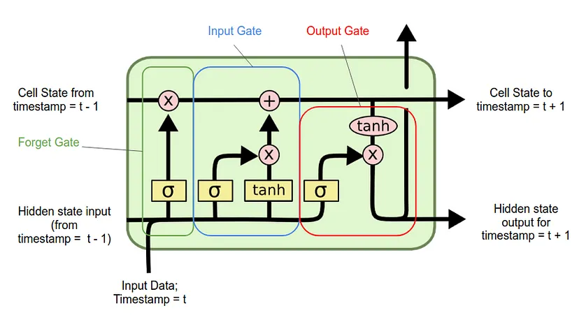

# RNN
- A Critical Review of Recurrent Neural Networks for Sequence Learning

- Neural Machine Translation by Jointly Learning to Align and Translate (RNNSearch-50)

## Architecture Of RNN

For more clear understanding of the concept of RNN, let’s look at the unfolded RNN diagram.

Backpropagation Through Time (BPTT)
[Back Propagation Through Time (BPTT). Image by Author
]

# LSTM
How Recurrent Neural Networks and Long Short-Term Memory Work

